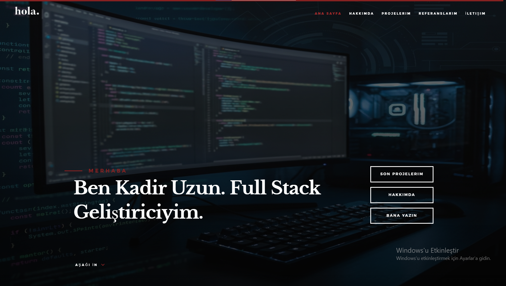
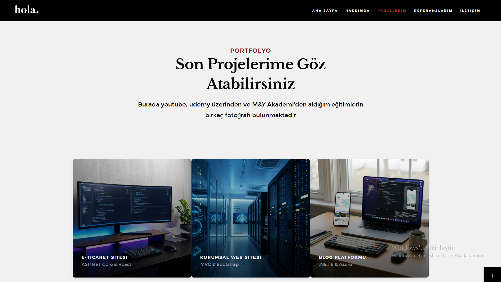
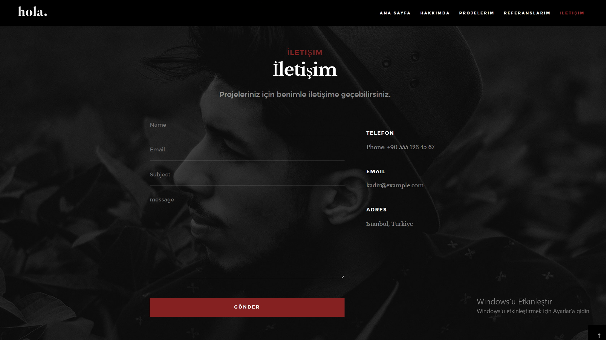
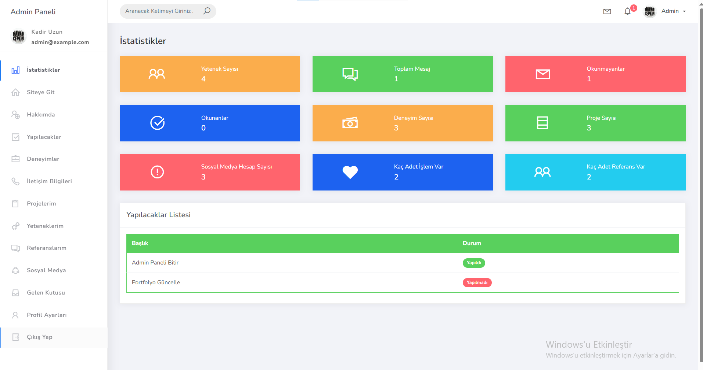
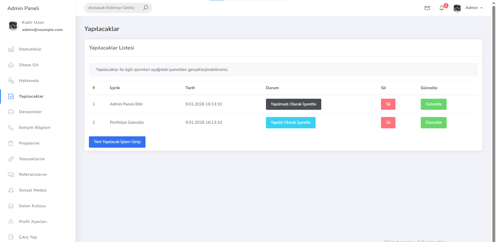
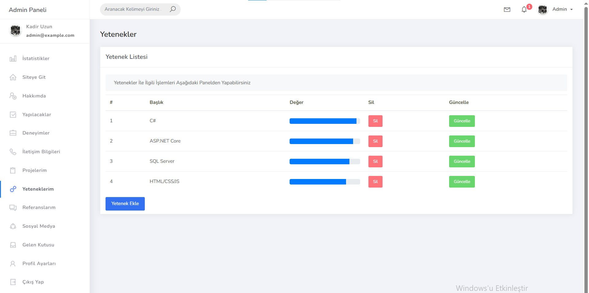
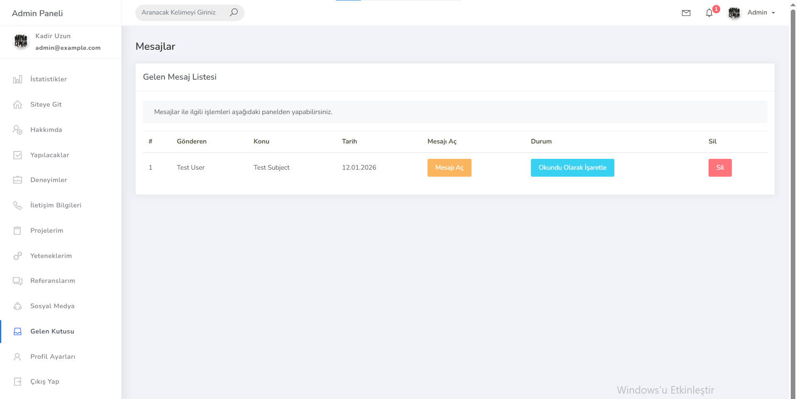

# Asp.Net Core ile Dinamik MyPortfolio Sitem

MyPortfolio, yeteneklerinizi, deneyimlerinizi ve projelerinizi sergileyebileceğiniz, aynı zamanda dinamik bir yönetim paneli içeren, **ASP.NET Core 6.0** ile geliştirilmiş kapsamlı bir kişisel portföy web uygulamasıdır.

## 🚀 Proje Hakkında

Bu proje, kişisel markanızı oluşturmak ve yönetmek için modern bir arayüz ve güçlü bir arka uç sunar. Ziyaretçiler portföyünüzü inceleyip sizinle iletişime geçebilirken, siz de gelişmiş **Admin Paneli** üzerinden tüm içerikleri (Yetenekler, Deneyimler, Referanslar vb.) kolayca yönetebilirsiniz.

## ✨ Özellikler

### 🌍 Arayüz (Public UI)
*   **Ana Sayfa**: Genel tanıtım ve özet bilgiler.
*   **Hakkımda**: Kişisel bilgiler ve tanıtım yazısı.
*   **Yetenekler**: İlerleme çubukları (progress bars) ile görselleştirilmiş yetenek listesi.
*   **Deneyimler**: Zaman çizelgesi veya liste formatında iş/eğitim deneyimleri.
*   **Projeler/Portföy**: Tamamlanan projelerin görselleri ve detayları.
*   **Referanslar**: Müşteri veya iş arkadaşlarından gelen yorumlar.
*   **İletişim**: Ziyaretçilerin size ulaşabileceği mesaj formu.

### 🛠 Yönetim Paneli (Admin Dashboard)
*   **Dashboard**: Genel bakış, istatistikler ve hızlı erişim kartları.
*   **İstatistikler**: Portföy verilerine dair grafiksel veya sayısal analizler.
*   **İçerik Yönetimi**: Hakkımda, Yetenekler, Deneyimler, Projeler, Hizmetler ve Referanslar için Ekleme/Silme/Güncelleme (CRUD) işlemleri.
*   **Mesaj Kutusu**: İletişim formundan gelen mesajları görüntüleme ve yönetme.
*   **To-Do Listesi**: Kişisel yapılacaklar listesi notları.
*   **Profil Yönetimi**: Admin kullanıcı bilgileri ve şifre güncellemeleri.
*   **Bildirimler**: İşlem durumları ve uyarılar.

## 🧰 Teknolojiler ve Araçlar

*   **Platform**: .NET 6.0
*   **Framework**: ASP.NET Core MVC
*   **Veritabanı**: MSSQL (Microsoft SQL Server)
*   **ORM**: Entity Framework Core (Code First Yaklaşımı)
*   **Frontend**: HTML5, CSS3, JavaScript
*   **CSS Framework**: Bootstrap (Admin: Ready Bootstrap Dashboard, UI: Özel Temalar)
*   **Kütüphaneler**: 
    *   FluentValidation (Doğrulama işlemleri için)
    *   Toastr / SweetAlert (Bildirimler için)

## 🌟 Öne Çıkan Özellikler

Projenin geliştirilme sürecinde modern yazılım prensipleri ve verimlilik odaklı teknikler ön planda tutulmuştur:

*   **🧩 Partial Components (Parçalı Bileşen Yapısı)**: 
    Sayfa içerisindeki modüller (Header, Footer, Navbar vb.) birbirinden bağımsız `ViewComponent` ve `PartialView` yapıları kullanılarak parçalanmıştır. Bu sayede:
    *   Kod tekrarı önlenmiş,
    *   Yönetilebilirlik ve bakım kolaylığı artırılmış,
    *   Daha temiz ve okunabilir bir HTML/CSHTML yapısı elde edilmiştir.

*   **🏗️ Code First Yaklaşımı**:
    Veritabanı mimarisi, tamamen C# sınıfları (Entity'ler) üzerinden kurgulanmıştır. Entity Framework Core'un **Code First** yaklaşımı sayesinde:
    *   Veritabanı bağımlılığı en aza indirilmiş,
    *   Gelişmiş migration yapısı ile veritabanı güncellemeleri kolayca yönetilebilir hale gelmiştir.

*   **🎨 Modern ve Kullanıcı Odaklı Tasarım**:
    *   UI tarafında kullanıcı deneyimini (UX) artıran, pastel tonların hakim olduğu, şık ve minimal bir tasarım dili kullanılmıştır.
    *   Admin panelinde ise verimliliği artıran, responsive (mobil uyumlu) ve profesyonel bir dashboard teması tercih edilmiştir.

---

## 👏 Teşekkür
Bu projenin geliştirilmesindeki katkıları ve rehberliği için **Murat Yücedağ** hocama teşekkür ederim.

---

## 📸 Proje Arayüzleri

### 1. 🏠 Ana Sayfa (Vitrin)

### 2. 🛠️ Admin Paneli
Sitenin tüm yönetiminin yapıldığı, detaylı yetkilere sahip yönetim merkezi.

